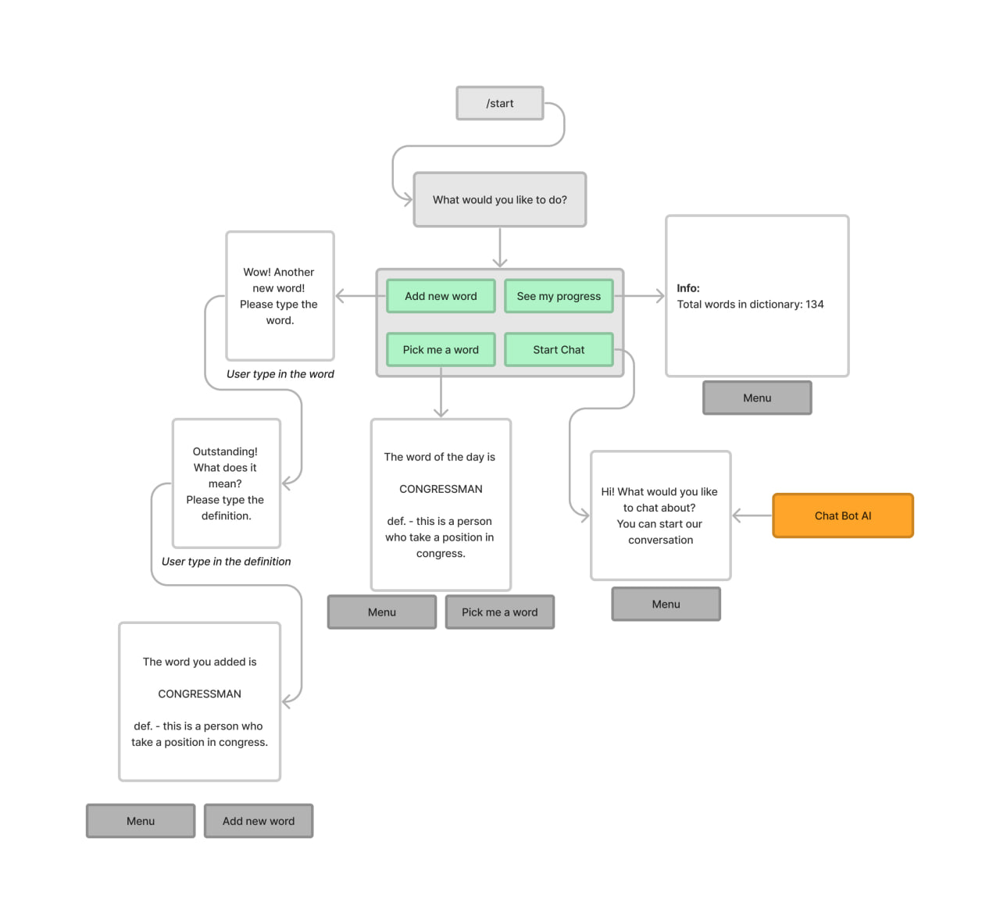

# The english learning bot
### Best approach for English learning

Welcome to the Oxford Dictionary style English learning telegram bot. It 
helps people to remember the words in order they used to.
Main advantage of this approach is that you write the definition of the word
in your own words. Then when you read it, you can easily guess the meaning.

Let`s look at the main structure of the bot. 

Features are: 
- adding new word to dictionary with definition; 
- picking random word with definition from the dictionary;
- check the number of words in dictionary;
- chat with AI.

### AI chat is build with 

It can reply to user messages and be precise to the topic, however in the 
current vesrion we do not provide context to the bot, so it cannot
keep the conversation and remember the previous things. Basically, you can 
check your ability to use new words. You can easily check out your
knowledge with the bot reply. 

## How to use it? 

You can use different commands to operate with the bot:

**/Main_menu** to return to the start

**/Pick_me_a_word** to get a random word from your vocabluary
                        
**/Add_new_word** to add more words to your dictionary
                        
**/Start_chat** to speak to AI
                        
**/See_my_progress** to see the usage and the size of vocabluary

## Цитирование
@misc{Aniemore,
  author = {Artem Amentes},
  title = {English learning telegram bot in Oxford dictionary style},
  year = {2023},
  publisher = {GitHub},
  journal = {GitHub repository},
  howpublished = {https://github.com/ArtemAmentes/telegram-bot-for-english-learners},
  email = {amentes.av@phystech.edu}
}